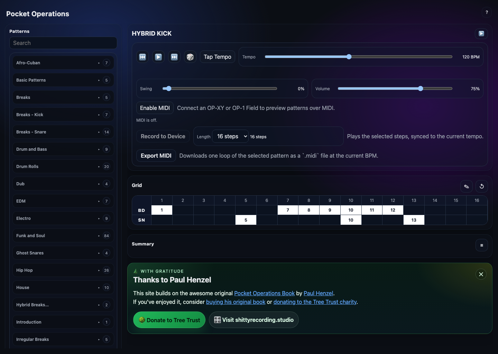
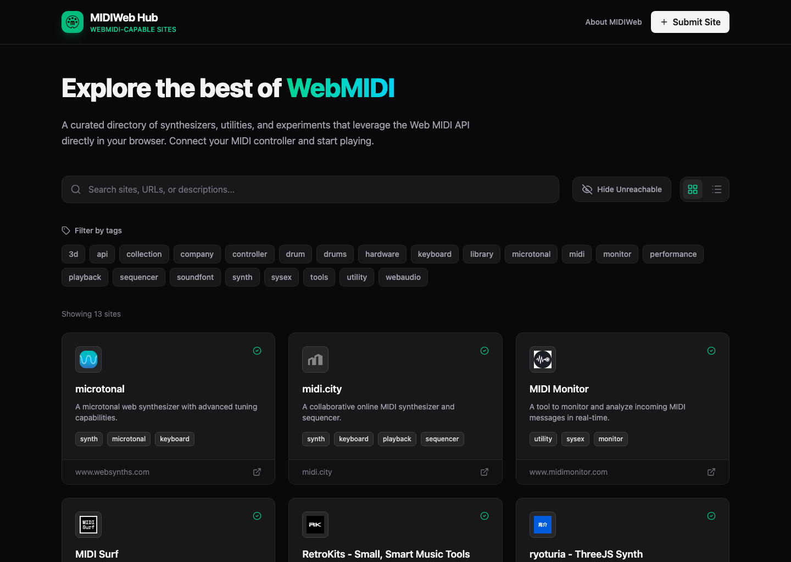
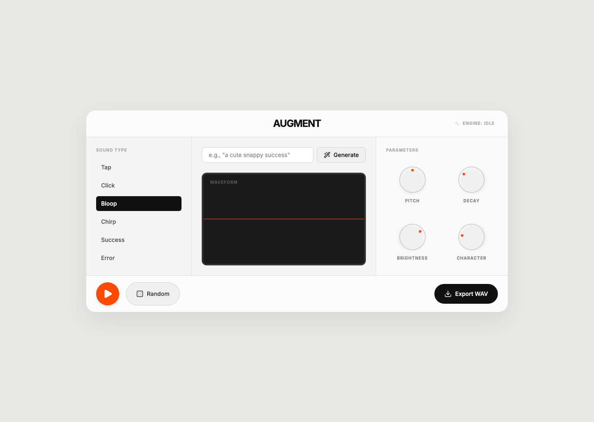

---
# Feel free to add content and custom Front Matter to this file.
# To modify the layout, see https://jekyllrb.com/docs/themes/#overriding-theme-defaults

layout: home

---

# Welcome

5of12 gets to do some pretty innovative work in the world of spatial computing. Where possible we like to share what we're learning, rather than keep all this knowledge trapped in our heads.

If you find something interesting, or have a project you'd like to talk about, get in touch. 

## Check out some examples of our work

### Playtonik

Playtonik is a musical fidget toy app for iOS. It combines playful physics interactions with immersive sound and expressive haptics for a relaxing and inspiring musical experience. It also has great connectivity with MIDI, with the ability to control or be controlled by external gear. This little app brings together everything we enjoy about building software!

Playtonik is also a winner of a 2025 [MIDI Association Innovation Award](https://midi.org/innovation-awards) for Software Prototypes! 
Find out more at [5of12.co.uk/playtonik](https://5of12.co.uk/#playtonik)

### MediaPipe Playground

Gesture control running in your browser. Interaction from across the room using comfortable motions centred around you. No headset, no specialised cameras, just you and a webcam!

[5of12.github.io/MediaPipe-Playground](https://5of12.github.io/MediaPipe-Playground)

- 🦈 Give 3D objects a spin, with a single hand!
  - [Spin The Shark](https://5of12.github.io/MediaPipe-Playground/examples/SpinTheShark.html)
- 🌌 Head to the stars with pose detections. Engage warp speed!
  - [Warp Fingers](https://5of12.github.io/MediaPipe-Playground/examples/WarpFingers.html)
- 🗺️ Explore mapping data with two handed gestures. Pinch and zoom!
  - [World in your Hands](https://5of12.github.io/MediaPipe-Playground/examples/WorldInYourHands.html)

<section class="experiments-section" aria-labelledby="experiments-heading">
  <h2 id="experiments-heading">Experiments</h2>
  
We are also exploring WebAudio and WebMIDI in the browser through a growing set of musical tools, utilities and experiments.

  

    <article class="experiment-card">
      
      

        <h3 class="experiment-card__title">Pocket Operations</h3>
        
A browser-based MIDI pattern recorder for sketching drum patterns, auditioning grooves, sending them to hardware over Web MIDI, and exporting loops as <code>.midi</code> files.

        

          <a class="experiment-card__link experiment-card__link--primary" href="https://5of12.github.io/PocketOperations/">Launch</a>
          <a class="experiment-card__link" href="https://github.com/5of12/PocketOperations">View on GitHub</a>
        

      

    </article>

    <article class="experiment-card">
      
      

        <h3 class="experiment-card__title">MIDIWeb-Hub</h3>
        
A curated directory of websites that support WebMIDI, helping musicians, makers, educators and developers discover browser-based musical tools and experiments.

        

          <a class="experiment-card__link experiment-card__link--primary" href="https://5of12.github.io/MIDIWeb-Hub/">Launch</a>
          <a class="experiment-card__link" href="https://github.com/5of12/MIDIWeb-Hub">View on GitHub</a>
        

      

    </article>

    <article class="experiment-card">
      
      

        <h3 class="experiment-card__title">Augment</h3>
        
An Audio UX generator built with Tone.js for creating interface sounds, bleeps, bloops, clicks and pops directly in the browser.

        

          <a class="experiment-card__link experiment-card__link--primary" href="https://5of12.github.io/Augment/">Launch</a>
          <a class="experiment-card__link" href="https://github.com/5of12/Augment">View on GitHub</a>
        

      

    </article>
  

</section>
